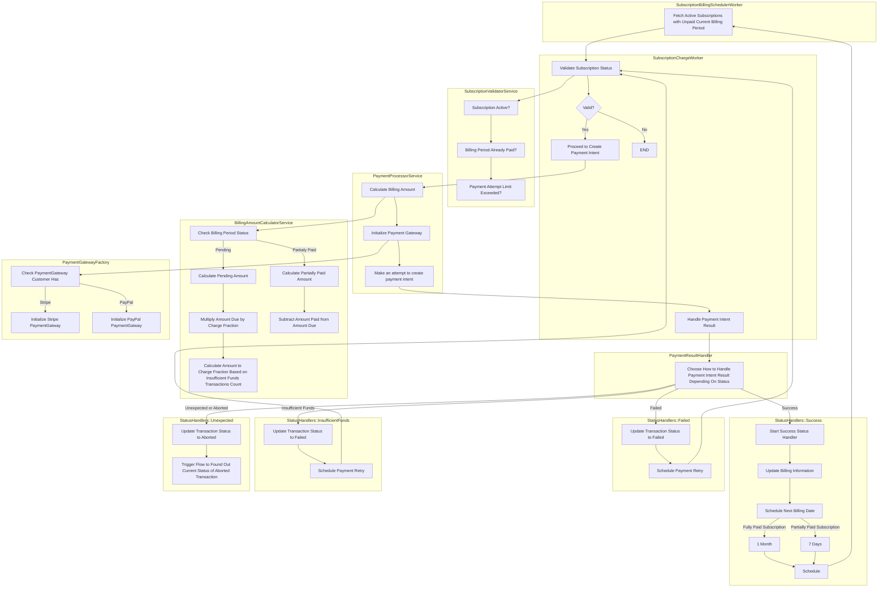

Installation Guide

```bash
docker-compose build
docker run --rm api bash ./initialize.sh

docker-compose up
````


```mermaid
flowchart TD
    subgraph SubscriptionBillingSchedulerWorker
        AA[Fetch Active Subscriptions with Unpaid Current Billing Period]
    end

    subgraph SubscriptionChargeWorker
        AA --> BA[Validate Subscription Status]
        BA --> BB{Valid?}

        BB -->|Yes| BC[Proceed to Create Payment Intent]
        BB -->|No| BD[END]
        BE[Handle Payment Intent Result]
    end

    subgraph SubscriptionValidatorService
        BA --> CA[Subscription Active?]
        CA --> CB[Billing Period Already Paid?]
        CB --> CC[Payment Attempt Limit Exceeded?]
    end

    subgraph PaymentProcessorService
        BC --> DA[Calculate Billing Amount]
        DA --> DB[Initialize Payment Gateway]
        DB --> DC[Make an attempt to create payment intent]
        DC --> BE
    end


    subgraph BillingAmountCalculatorService
        DA --> EB[Check Billing Period Status]
        EB -->|Pending| EC[Calculate Pending Amount]
        EB -->|Partialy Paid| EE[Calculate Partially Paid Amount]
        EC --> EG[Multiply Amount Due by Charge Fraction]
        EE --> EH[Subtract Amount Paid from Amount Due]

        EG --> EI[Calculate Amount to Charge Fraction Based on Insufficient Funds Transactions Count]
    end

    subgraph PaymentGatewayFactory
        DB --> FA[Check PaymentGateway Customer Has]

        FA -->|Stripe| FB[Initialize Stripe PaymentGatway]
        FA -->|PayPal| FC[Initialize PayPal PaymentGatway]
    end

    subgraph PaymentResultHandler
        BE --> GA[Choose How to Handle Payment Intent Result Depending On Status]
    end

    subgraph StatusHandlers::Success
        GA --> |Success| HA[Start Success Status Handler]
        HA --> HB[Update Billing Information]
        HB --> HC[Schedule Next Billing Date]
        HC --> |Fully Paid Subscription| HD[1 Month]
        HC --> |Partially Paid Subscription| HE[7 Days]

        HD --> HF
        HE --> HF
        HF[Schedule] --> AA
    end

    subgraph StatusHandlers::Failed
        GA --> |Failed| IB[Update Transaction Status to Failed]
        IB --> ID[Schedule Payment Retry]
        ID --> BA
    end

    subgraph StatusHandlers::InsufficientFunds
        GA --> |Insufficient Funds| JA[Update Transaction Status to Failed]
        JA --> JD[Schedule Payment Retry]
        JD --> BA
    end

    subgraph StatusHandlers::Unexpected
        GA --> |Unexpected or Aborted| KA[Update Transaction Status to Aborted]
        KA --> KD[Trigger Flow to Found Out Current Status of Aborted Transaction]
    end
```
