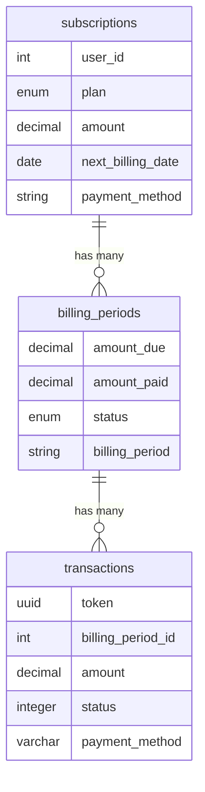
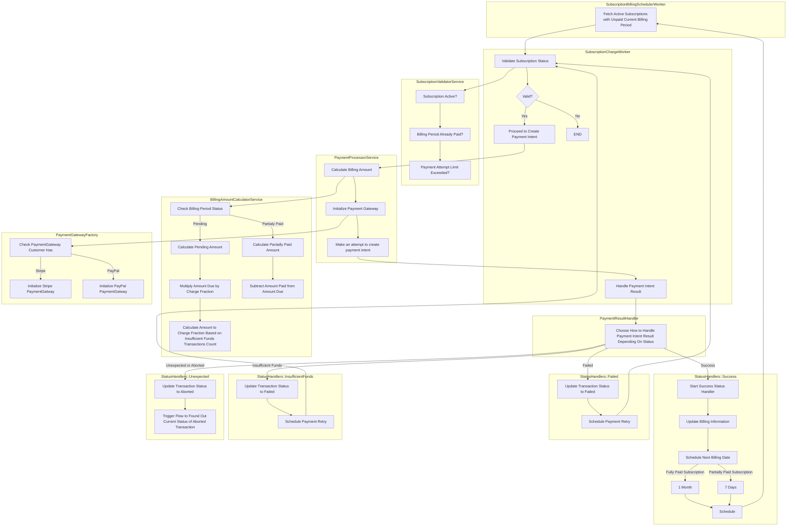

### Subscription Billing System
This project is a subscription billing system that automates customer billing, tracks payment statuses, and handles transaction processing. The service includes tables for managing customer subscriptions, billing periods, and individual transaction details.

#### Installation Guide
Follow these steps to set up the project locally using Docker.

```bash
# Step 1: Initialize environment variables for the API service and the database
cat env/.env.api.example >> env/.env.api.development
cat env/.env.database.example >> env/.env.database.development

# Step 2: Build the project with Docker
docker-compose up --build

# Step 3: Create the database, run migrations, and seed initial data
docker exec -it api sh ./initialize.sh
```

### Table Descriptions

#### Subscriptions Table
The subscriptions table stores information about each user’s subscription, including details about their payment method, subscription status, and chosen plan.

#### Billing Periods Table
The billing_periods table tracks each subscription’s billing cycle details, such as the due amount, amount paid, and the payment status for each billing period.

#### Transactions Table
The transactions table logs individual transactions for each billing period, capturing details such as the transaction amount, status, and payment method used.



### Workflow
The main idea is to have a service that, using a cron job, will charge subscription fees according to the billing date. Before processing a payment, we validate all the conditions required to proceed.
Among these conditions, we check if there have been 4 or more transactions with an “insufficient funds” status for the given subscription in the current billing period.
After validation, we calculate the amount due, which may vary depending on the status of previous transactions, subscription plan etc. Once the amount is calculated, we initialize the payment gateway responsible for processing the payment for current subscription.
After the payment is processed, we handle the result and, depending on the transaction status, take appropriate actions, such as scheduling the next payment in case of a successful transaction or scheduling a retry in case of a failed transaction, and so on.


